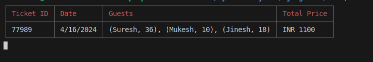

# JalanTechnologyAssignment

This repository contains solutions for the coding assignments given by Jalan Technology.

## First Question: Array Arrangement

The program takes an array of numbers as input, both positive and negative. It rearranges the array in an alternate order such that every positive number is followed by a negative number throughout.

## Second Question: Zoo Software

This program implements a Zoo Ticketing Software using Object-Oriented Programming (OOP) principles. It includes the following features:

- **Ticket Creation**: Allows the creation of tickets with guest details including name, age.
- **Saving to JSON File**: Saves the ticket data along with all guest details in a JSON file.
- **Display All Tickets**: Displays all tickets along with guest details in a tabular format.
- **Ticket Verification**: Checks if a ticket with a given ID is issued or not and displays its details.
- **User Interface**: Utilizes readline for input and output interactions with the user.
- **Table Display**: Utilizes cli-table3 for presenting data in a tabular format.
- **Styling**: Implements chalk for better text styling and colorization.

## Usage

1. For the Array Arrangement program, run the provided JavaScript file and provide the array of numbers as input.
2. For the Zoo Software, run the provided JavaScript file and follow the prompts to create tickets, display ticket list, and verify issued tickets.

## Requirements

- Node.js
- npm packages: chalk, readline, fs, cli-table3

## Installation

1. Clone the repository:
   ```bash
    git clone https://github.com/AnkitJain78/JalanTechnologyAssignment.git

2. change directory:
   ```bash
   cd Q2
4. Install packages:
   ```bash
   npm i

## Screenshots





